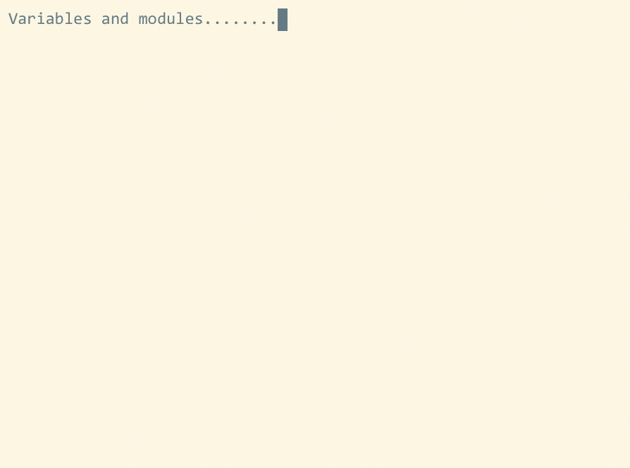

# Scrolling wrapped lines
In the presence of wrapped lines, the default scrolling maps `<C-d>` and
`<C-u>` can cause
the cursor to jump around erratically. This is extremely disorienting
when navigating documents.

The fundamental problem is that VIM tries to
jump by a number of lines equaling exactly one-half page height
-- but because the first line in the viewer
is constrained to always be the start of a line, not a line continuation
fragment, this often causes the screen-relative line on which the cursor is positioned
to change.

This plugin corrects this annoying behavior.
When line wrapping is disabled, this plugin has no effect.

## Maps
This plugin overrides the half-page scrolling maps `<C-d>` and `<C-u>` and
introduces new quarter-page scrolling maps `<C-j>` and `<C-k>`.

For each of these maps, instead of scrolling by exactly
one-half or one-quarter the window height, the plugin scrolls
by as close as possible to one-half or one-quarter
the window height **without messing up the relative cursor line position**.

## Commands
`:WrapToggle`: Toggles line wrapping for the current buffer and applies a series of buffer-local remaps (e.g. `nnoremap <buffer> gj j`) so that normal-mode motion keys follow the wrapped lines instead of the actual lines. Call without arguments to toggle the wrapping mode on and off. Call with `0` and `1` to set the wrapping mode to the on or off states explicitly.

## Options
`g:scrollwrapped_wrap_filetypes`: Specifies the filetypes for which `:WrapToggle` is called when the file is opened. By default, this is `['bib','tex','markdown','rst','liquid']`.

## Demonstration
The below demonstrates how `vim-scrollwrapped` makes navigating LaTeX
documents with heavily wrapped lines a smooth experience, even with a tiny
terminal window. Note that the cursor **does not move up and down the screen**.

<!--  -->


# Installation
Install with your favorite [plugin manager](https://vi.stackexchange.com/questions/388/what-is-the-difference-between-the-vim-plugin-managers).
I highly recommend the [`vim-plug`](https://github.com/junegunn/vim-plug) manager,
in which case you can install this plugin by adding
```
Plug 'lukelbd/vim-scrollwrapped'
```
to your `~/.vimrc`.

